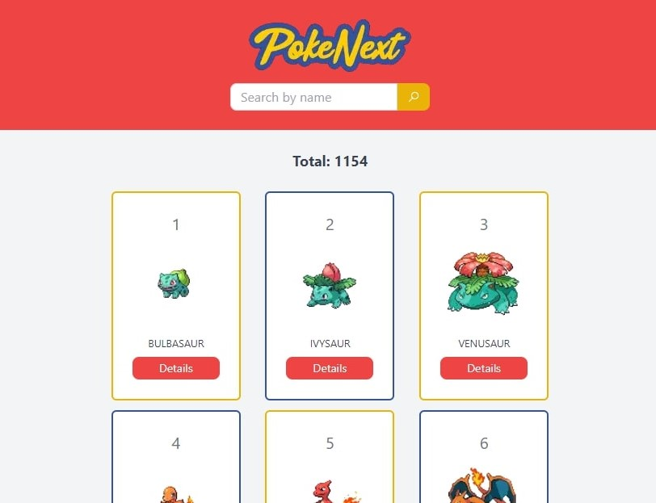

## PokeNext

A Pokedex project made with `Next.js`, `TypeScript` and `Tailwindcss`.

## Next.js Features
* [getStaticPaths](https://nextjs.org/docs/api-reference/data-fetching/get-static-paths)
* [getStaticProps](https://nextjs.org/docs/api-reference/data-fetching/get-static-props)
* [Dynamic Routes](https://nextjs.org/learn/basics/dynamic-routes/dynamic-routes-details)

## Used API
* [PokeAPI](https://pokeapi.co/)

Deployed by [Vercel](https://vercel.com/) at the following link [PokeNext](https://pokenext-gui-leandro.vercel.app/)

## Project Preview

  

